# Deadbolt

> **Your security data belongs to you. Local by default.**

A privacy-first security assessment platform for systems you own or are
explicitly authorized to test. The core loop: **Discover → Safely Validate →
Explain → Remediate → Retest → Monitor.**

**Current stage: V0.5 — everything above, plus verified outside-in assessment.** An optional worker
program running outside the assessed network probes explicitly authorized targets (your own public IP,
a VPS you control) with read-only probes and reports back; results land as ordinary findings with
full evidence. Off by default — nothing leaves the machine until the operator opts in.

## Architecture

```mermaid
flowchart TD
    CFG(["Safety boundary<br/>config/authorized_targets.yaml<br/>every target must be authorized: true<br/>agent refuses to run otherwise"])
    SCHED["Scheduler<br/>daily / weekly / every-N-hours"]
    DISC["Discovery<br/>asset enumeration"]
    VAL["Safely Validate<br/>read-only checks — no exploits,<br/>no brute force, no payloads"]
    LIFE["Findings lifecycle<br/>evidence-backed findings"]
    DB[("SQLite<br/>findings.db")]
    API["FastAPI API<br/>bound to 127.0.0.1:8000"]
    DASH["Dashboard"]
    TREND["Trends & Retest"]
    EXP["Exporters<br/>e.g. Splunk"]

    subgraph EXT["Outside-in — V0.5, opt-in, off by default"]
        W["External worker<br/>registers with one-time token"]
        PROBES["Read-only probes<br/>ports · banners · TLS certs<br/>DNS MX/TXT/SPF · HTTP headers"]
    end

    CFG --> DISC
    SCHED --> DISC
    DISC --> VAL
    VAL --> LIFE
    LIFE --> DB
    API <--> DB
    DASH <--> API
    LIFE --> TREND
    LIFE --> EXP
    W -->|"polls assessment queue"| API
    W --> PROBES
    PROBES -->|"results ingested as findings"| LIFE

    style CFG fill:#1a2e1a,stroke:#4caf50
    style EXT fill:#1a2333,stroke:#64b5f6
```



## Quickstart

**Docker (one command)** — works on any Linux server, VPS, or VM with Docker:

```bash
git clone https://github.com/SilentN0de/deadbolt && cd deadbolt
# Review the scope file first (default: 127.0.0.1 only — safe anywhere)
cat config/authorized_targets.yaml
docker compose up -d --build
# then open http://127.0.0.1:8000  (dashboard)
```

The port is published on the host's loopback only, findings persist in a
Docker volume, and `./config` is mounted so you can edit the scope on the
host. `docker compose logs -f` to watch it, `docker compose down` to stop.

**Bare metal / VM** (no Docker — a `deploy/deadbolt.service` systemd unit is
shipped in `deploy/`):

```bash
# 1. Create an isolated environment and install
python3 -m venv .venv && source .venv/bin/activate
pip install -r requirements.txt

# 2. Review the scope file (default: 127.0.0.1 only — safe anywhere)
cat config/authorized_targets.yaml

# 3. Run discovery against your authorized targets
python -m agent.discovery --scope config/authorized_targets.yaml

# 4. Serve the API + dashboard (binds 127.0.0.1 only)
./scripts/run_dev.sh
# then open http://127.0.0.1:8000  (dashboard) or query the API:
curl http://127.0.0.1:8000/health
curl http://127.0.0.1:8000/findings
```

## Project layout

| Path | Purpose |
| --- | --- |
| `agent/` | Local agent: scope enforcement (`scope.py`) + read-only discovery (`discovery.py`) |
| `api/` | FastAPI service (binds 127.0.0.1): health, runs, findings |
| `dashboard/` | Minimal findings dashboard (served at `/`) |
| `storage/` | SQLite layer: `schema.sql`, dataclasses, `Store` |
| `lifecycle.py` | Finding lifecycle state machine (V0.4) |
| `retest/` | Re-probing findings against current target state (V0.4) |
| `trends.py` | Snapshot-based trend series + summary (V0.4) |
| `scheduler/` | Automatic scheduled scans: config, next-run math, scan engine, background thread |
| `external/` | Outside-in assessment (V0.5): worker client (`worker.py`), read-only probes (`probes.py`), registry + queue + ingest (`server.py`) |
| `common/` | Rotating file logging + local crash-report hook |
| `config/` | `authorized_targets.yaml` — the safety boundary |
| `scripts/` | `run_dev.sh` — launch the API; `simulate_e2e.py` — full pipeline simulation; `simulate_schedule.py` — scheduled-scan simulation; `simulate_external.py` — outside-in worker simulation |
| `tests/` | pytest suite (scope, data model, discovery, API, scheduler) |
| `docs/` | architecture, privacy, data model |
| `logs/` | Rotating logs + local crash reports (gitignored, never committed) |

## Scheduled scans

Deadbolt can scan automatically on a schedule you define — once a day
(e.g. 02:00), once a week (e.g. Monday 02:00), or every N hours. Each
scheduled run executes the standard pipeline: discovery → optional
read-only validation of new findings → retest of open findings → trend
snapshot. Nothing is ever patched or changed on targets; scans are
read-only, same as manual runs.

Configure it from the dashboard's **⏰ Scheduled scans** panel, or via
the API:

```bash
# run every day at 02:00 local time, validate new findings automatically
curl -X PUT http://127.0.0.1:8000/schedule \
  -H 'Content-Type: application/json' \
  -d '{"enabled": true, "cadence": "daily", "time": "02:00",
       "auto_validate": true}'

# check status: config, last run, next run, last result
curl http://127.0.0.1:8000/schedule

# trigger a scan right now (runs in the background)
curl -X POST http://127.0.0.1:8000/schedule/run
```

The schedule is stored in the local database (`settings` table), so it
survives restarts. The API starts a background thread on boot that runs
due scans; every change and every run is audit-logged.

## Safety & authorization
**Read this before adding targets.** The agent refuses to run unless
`config/authorized_targets.yaml` exists and explicitly lists targets with
`authorized: true`. Public IPs and `0.0.0.0/0` additionally require
`authorization_acknowledged: true`. Every allow/deny decision is logged and
written to an immutable audit table.

- Only assess systems you own or are explicitly authorized to test.
- Discovery is **read-only and non-destructive**: TCP connect + banner grab
  only. No exploits, payloads, brute force, or lateral movement.
- See [SECURITY.md](SECURITY.md) and [docs/architecture.md](docs/architecture.md).

## Roadmap

- **V0.0** ✅ foundation (repo, docs, architecture, privacy)
- **V0.1** ✅ local discovery
- **V0.2** ✅ AI analyst: local evidence-backed explanations + remediation
- **V0.3** ✅ controlled validation: bounded, approved, audited confirmation
- **V0.4** ✅ fix & verify: retesting, finding lifecycle, trend tracking
- **V0.5** ✅ external assessment: verified outside-in worker (opt-in, off by default)

See [CHANGELOG.md](CHANGELOG.md) for version history.

## External assessment (outside-in)

Deadbolt can also show what an attacker on the internet sees. A small worker program runs on a
machine *outside* the assessed network and probes only explicitly authorized targets with
read-only probes (port discovery, banner intel, TLS certificate inspection, DNS MX/TXT/SPF,
HTTP security headers). Results come back to the local API as ordinary findings with full
evidence. **Off by default**, per the privacy promise: enable it in the dashboard's
🌐 Outside-in panel after reading the disclosure, or via the API.

```bash
# on the outside machine (any box with Python 3, stdlib only)
python -m external.worker --api http://<deadbolt-host>:8000 register --name my-pi
python -m external.worker --api http://<deadbolt-host>:8000 run-once

# on the Deadbolt API host (operator)
curl -X PUT http://127.0.0.1:8000/external/status \
  -H 'Content-Type: application/json' -d '{"enabled": true}'
curl -X POST http://127.0.0.1:8000/external-assessments \
  -H 'Content-Type: application/json' \
  -d '{"worker_id": "<id>", "targets": ["203.0.113.10"], "probes": ["port_discovery"]}'
```

Targets must be in the operator-approved scope: IPs resolve against `config/authorized_targets.yaml`,
and DNS-probe domains must be listed under its `external_domains` allowlist. Workers authenticate
with per-worker bearer tokens (stored as hashes, revoked in one click). Enqueue, polling, and
result ingest are all gated by the kill switch and audit-logged. `scripts/simulate_external.py`
exercises the whole flow against the simulated lab.
